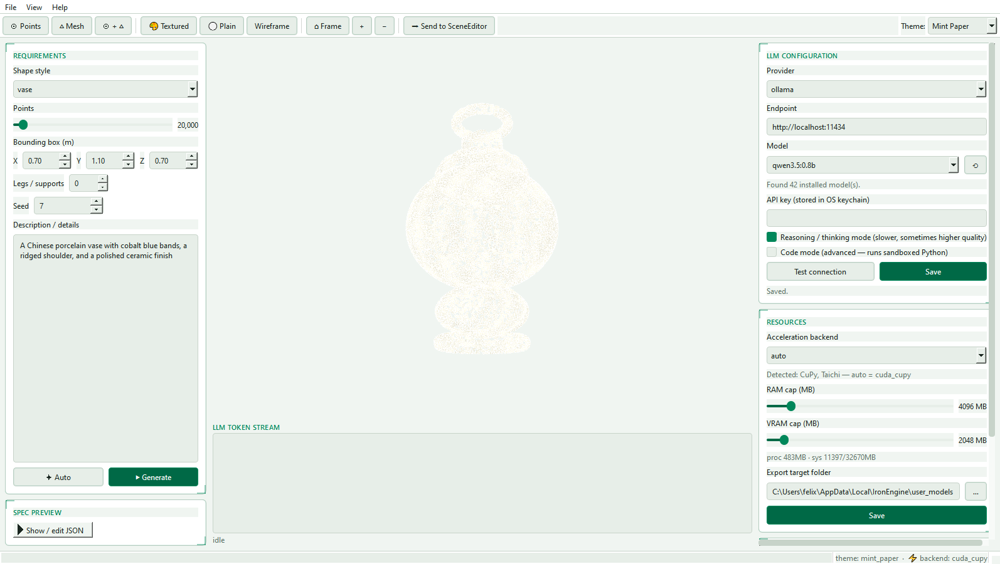
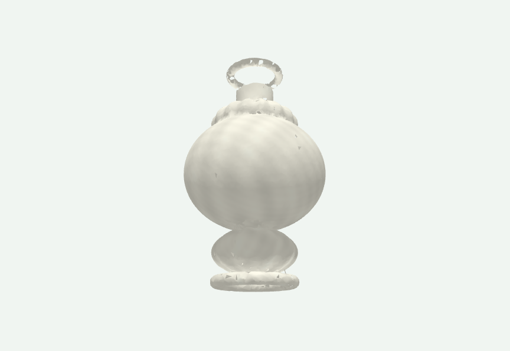

<div align="center">

# IronEngine 3D Creator

### Prompt-to-3D desktop generator with structural repair, live viewport preview, and local/cloud LLM support

<p>
  
  
  
  
  
</p>

Turn natural-language prompts into editable 3D point clouds, repair common structural mistakes automatically, preview the result in a live Qt/OpenGL viewport, and export to formats that fit the wider IronEngine toolchain.

Built and packaged by **NiusRobotLab**.

</div>

---

## Why this project exists

Most LLM-to-3D experiments fail in the same places: legs float, supports intersect badly, repeated parts lose spacing, and tiny local models drift out of structure. `IronEngine 3D Creator` solves that by making the model choose a compact procedural recipe instead of drawing raw geometry directly.

The workflow is:

```text
Prompt 鈫?SOUL rules 鈫?LLM JSON spec 鈫?validator 鈫?integrity repair 鈫?point-cloud sampler 鈫?mesh reconstruction 鈫?preview/export
```

That keeps generations fast, seedable, reproducible, and much easier to repair than arbitrary mesh output.

## Screenshots

### Full UI driven locally with `qwen3.5:0.8b`



### Generated point-cloud viewport


### Reconstructed mesh preview



The screenshots above were captured from the local app flow in the `IronEngineWorld` Conda environment using Ollama with `qwen3.5:0.8b` and a porcelain-vase prompt.

## Highlights

- **Structured generation**: the LLM returns a compact `GenerationSpec` of primitives, transforms, labels, and surface features.
- **Deterministic integrity repair**: grounding, attachment, spacing, and framework repair happen after parsing so common structural failures are fixed automatically.
- **Real desktop UI**: PySide6-based editor with prompt controls, streaming token view, live viewport, mesh mode, and editing tools.
- **Multiple model backends**: Ollama and LM Studio locally, plus Anthropic and OpenAI in the cloud.
- **Renderer API included**: offscreen render helpers let you create RGBA previews without opening the full app.
- **Package-ready layout**: Conda environment file, wheel manifest, packaged prompt rules, contributor guide, and changelog are included.

## Core capabilities

| Area | What it does |
|---|---|
| Generation | Produces 3D point clouds from text prompts or auto templates |
| Integrity | Repairs grounding, adjacency, symmetry, and framework alignment |
| Geometry | Supports procedural primitives including `box`, `sphere`, `cylinder`, `capsule`, `cone`, `torus`, `ellipsoid`, `prism`, `helix`, and `plane` |
| Surface detail | Applies features such as `scratch`, `curve_pattern`, `bump_field`, `dent`, `erosion`, `ridges`, `holes`, and `fur` |
| Rendering | Shows points, mesh, or both with textured and plain color modes |
| Export | Writes `PLY`, `PCD`, `GLB`, and `OBJ` |
| Editing | Supports brush move, warp, paint, smooth, and undo/redo |
| Performance | Uses NumPy by default and can accelerate with optional GPU backends |

## Repository layout

```text
src/ironengine_3d_creator/
  alignment/   # parsing, schema, defaults, validation, integrity repair
  core/        # exporter, pipeline, resources, settings, session
  generation/  # samplers, features, textures, reconstruction
  llm/         # providers, prompts, model catalogs, thinking filters
  rendering/   # offscreen rendering API
  ui/          # Qt main window, panels, viewport, dialogs, workers

docs/
  INSTALL.md
  PROJECT_ANALYSIS.md
  assets/readme/

tools/
  benchmark.py
```

## Installation

### Recommended: Conda with `IronEngineWorld`

```powershell
conda env create -f environment.yml
conda activate IronEngineWorld
python -m pip install -e .
```

### If `IronEngineWorld` already exists

```powershell
conda activate IronEngineWorld
python -m pip install -e .
```

`open3d` is part of the base package requirements, so mesh reconstruction and export work out of the box after install.

## Optional extras

Use extras only for features you actually want:

```powershell
python -m pip install -e .[anthropic]
python -m pip install -e .[openai]
python -m pip install -e .[gpu_taichi]
python -m pip install -e .[gpu_cupy]
python -m pip install -e .[gpu_torch]
python -m pip install -e .[nvidia]
python -m pip install -e .[sim]
python -m pip install -e .[all]
```

| Extra | Purpose |
|---|---|
| `gpu_taichi` | Cross-platform GPU fallback with Taichi |
| `gpu_cupy` | CUDA array acceleration through CuPy |
| `gpu_torch` | PyTorch-based GPU fallback |
| `nvidia` | VRAM/resource monitoring via NVML |
| `anthropic` | Anthropic provider support |
| `openai` | OpenAI provider support |
| `sim` | IronEngine Sim / viewer integration |
| `all` | Installs all optional extras in one step |

## Local Ollama setup

The default local path is Ollama. The project already works with available `qwen3.5` variants such as `qwen3.5:0.8b`, `qwen3.5:2b`, `qwen3.5:4b`, and `qwen3.5:9b` when those models are installed locally.

```powershell
ollama serve
ollama pull qwen3.5:0.8b
```

Then in the app:

1. Set **Provider** to `ollama`.
2. Keep **Endpoint** as `http://localhost:11434`.
3. Select a local `qwen3.5` model.
4. Save the config.
5. Enter your prompt and click **Generate**.

## Run the application

```powershell
conda activate IronEngineWorld
python -m ironengine_3d_creator
```

After installation, this also works:

```powershell
ironengine-3d-creator
```

## How to use the app

### 1. Configure the model

- Choose a provider in the right-side **LLM configuration** panel.
- For local usage, use `ollama` with a `qwen3.5` model.
- Turn on **Reasoning / thinking mode** when you want better deliberation and can afford slower generation.
- Leave **Code mode** off unless you specifically want sandboxed Python generation instead of structured JSON specs.

### 2. Describe the object

Use the left-side **Requirements** panel:

- Pick a shape hint or leave it on auto.
- Set the point budget.
- Tune the approximate bounding box.
- Add support counts when helpful.
- Write a plain-language prompt with material, silhouette, and detail cues.

Example prompts:

- `A Chinese porcelain vase with cobalt blue painted bands and a polished ceramic finish`
- `A weathered iron fence with evenly spaced bars and decorative finials`
- `A low wooden stool with four legs and deep scratches across the seat`
- `A stylized quadruped creature with a wide torso and short legs`

### 3. Generate and inspect

- Click **Generate** for LLM-driven output.
- Click **Auto** to use built-in template generation without an LLM.
- Watch the token stream while the provider emits reasoning or JSON.
- Inspect the spec preview after generation.

### 4. View the model

- Use **Points**, **Mesh**, or **Points + Mesh** in the toolbar.
- Toggle **Textured** or **Plain** color mode.
- Use **Wireframe** when evaluating reconstructed meshes.
- Press `F` to frame the cloud.

### 5. Edit and export

- Use brush, warp, paint, or smooth from the editing panel.
- Export to `PLY`, `PCD`, `GLB`, or `OBJ`.
- Use **Send to SceneEditor** to hand off to downstream IronEngine tools when available.

## Keyboard shortcuts

| Action | Shortcut |
|---|---|
| Generate | `Ctrl+G` |
| Auto generate | `Ctrl+Shift+G` |
| Save session | `Ctrl+S` |
| Open session | `Ctrl+O` |
| Export | `Ctrl+E` |
| Undo | `Ctrl+Z` |
| Redo | `Ctrl+Y` or `Ctrl+Shift+Z` |
| User guide | `F1` |
| Frame camera | `F` |
| Points mode | `1` |
| Mesh mode | `2` |
| Points + mesh | `3` |

## Packaging and distribution

This repository is prepared to be consumed as a Python package.

### Build distributables

```powershell
conda activate IronEngineWorld
python -m build
```

### Install the built wheel locally

```powershell
conda activate IronEngineWorld
python -m pip install dist\ironengine_3d_creator-0.2.0-py3-none-any.whl
```

### Important packaging notes

- `SOUL.md` is bundled into the package so prompt rules still work from wheel installs.
- `environment.yml` provides the recommended Conda-first setup.
- `MANIFEST.in` includes the main docs and prompt assets in source distributions.
- The repository is licensed under the Apache License 2.0.

## Docs

- [`docs/INSTALL.md`](docs/INSTALL.md) 鈥?installation and package smoke-test notes
- [`docs/PROJECT_ANALYSIS.md`](docs/PROJECT_ANALYSIS.md) 鈥?architecture and repo-readiness audit summary
- [`CONTRIBUTING.md`](CONTRIBUTING.md) 鈥?development workflow notes
- [`CHANGELOG.md`](CHANGELOG.md) 鈥?tracked repository cleanup and packaging changes

## Known practical notes

- The best local experience comes from an already-running Ollama server.
- Small `qwen3.5` models are fast and usable because the app asks for a compact JSON recipe instead of full geometry.
- Mesh mode depends on point-cloud reconstruction quality, so very sparse generations may still look better in points mode.
- GPU extras are optional and should only be installed when they match your machine and drivers.

## License

This project is licensed under the Apache License 2.0. See [`LICENSE`](LICENSE) for the full text.

## Screenshot provenance

The current README images were produced locally from the real application flow using:

- Conda environment: `IronEngineWorld`
- Provider: `ollama`
- Model: `qwen3.5:0.8b`

If the UI or visual styling changes, refresh the embedded screenshots from a new local capture run before publishing.


