<div align="center">

# IronEngine 3D Creator

### Prompt-to-3D desktop generator for structurally valid point clouds, live viewport preview, and local/cloud LLM workflows

<p>
  <a href="https://pypi.org/project/ironengine-3d-creator/"></a>
  
  
  
  
  
</p>

<p>
  <a href="https://pypi.org/project/ironengine-3d-creator/"></a>
  <a href="docs/INSTALL.md"></a>
  <a href="https://github.com/dunknowcoding/IronEngine-3DCreator/issues"></a>
</p>

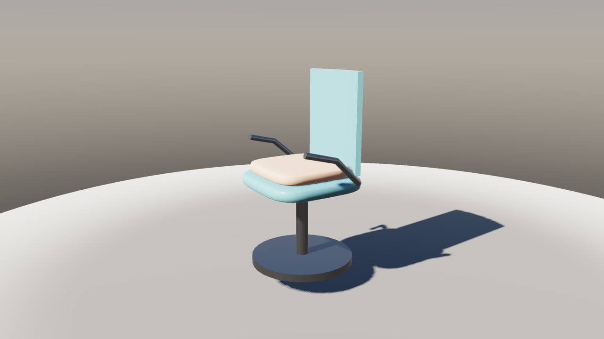

Turn natural-language prompts into editable 3D point clouds, repair common structural mistakes automatically, preview the result in a live Qt/OpenGL viewport, and export to formats that fit the wider IronEngine toolchain.

**Now available on PyPI** as `ironengine-3d-creator`. Built and packaged by **NiusRobotLab**.

</div>

> **Best for:** makers, tool builders, and local-AI tinkerers who want a practical path from prompt -> structured 3D output -> editable result.

**Jump to:** [Showcase](#showcase) | [Quick Start](#quick-start) | [What The Pipeline Actually Does](#what-the-pipeline-actually-does) | [Examples](#examples) | [Installation](#installation) | [How To Use The App](#how-to-use-the-app) | [Honest Limitations](#honest-limitations)

---

## Showcase

Every image below was produced by this repository's real generation pipeline and rendered offline with [IronEngine BonaFide](https://github.com/dunknowcoding/IronEngine-BonaFide) (CPU path tracer, image-based lighting, CSM shadows). The exact `GenerationSpec` behind each render — including the pipeline's own warnings — is checked in under [`docs/showcase/specs/`](docs/showcase/specs/), and [`tools/make_showcase.py`](tools/make_showcase.py) regenerates the whole set from scratch. Nothing here is hand-modelled.

| | | | |
|---|---|---|---|
| 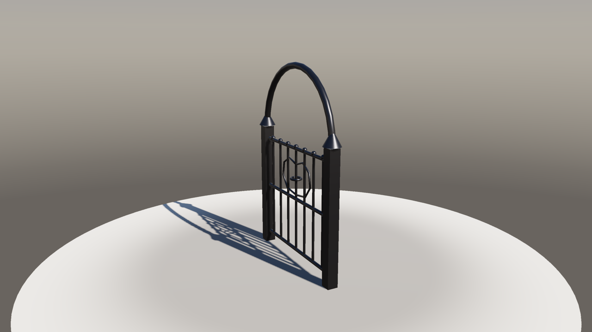 | 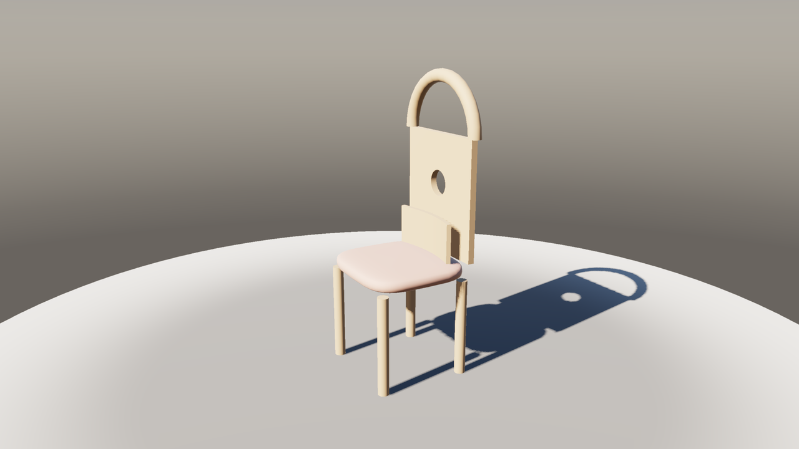 | 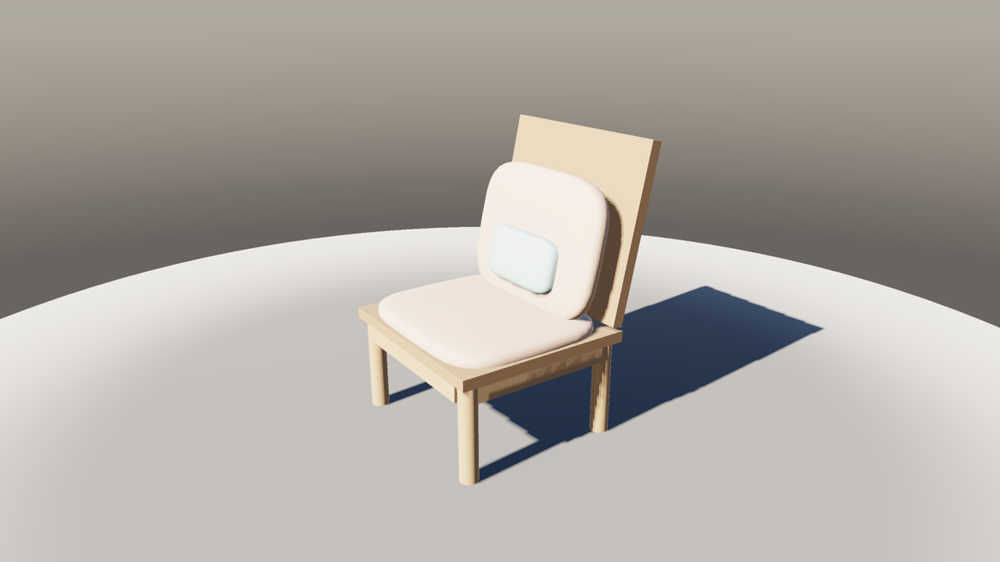 | 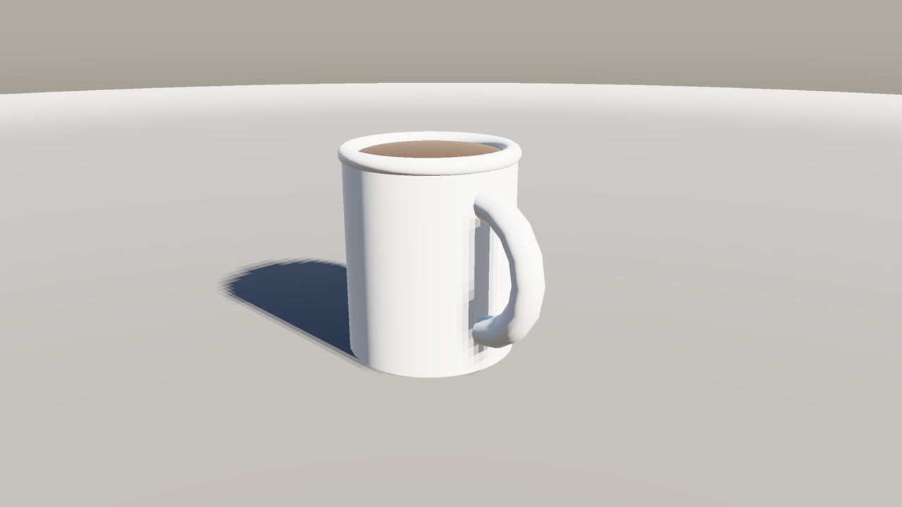 |
| **Garden gate** — `arch` + `tube` scrollwork; framework repair snapped 9 members between rails | **Arched chair** — mesh-level subtraction carved a real tunnel through the back panel | **Lounge chair** — validator clamped cushion thickness to the chair proportion guide | **Mug** — point-cloud CSG-lite hollow + swept `tube` handle |
| 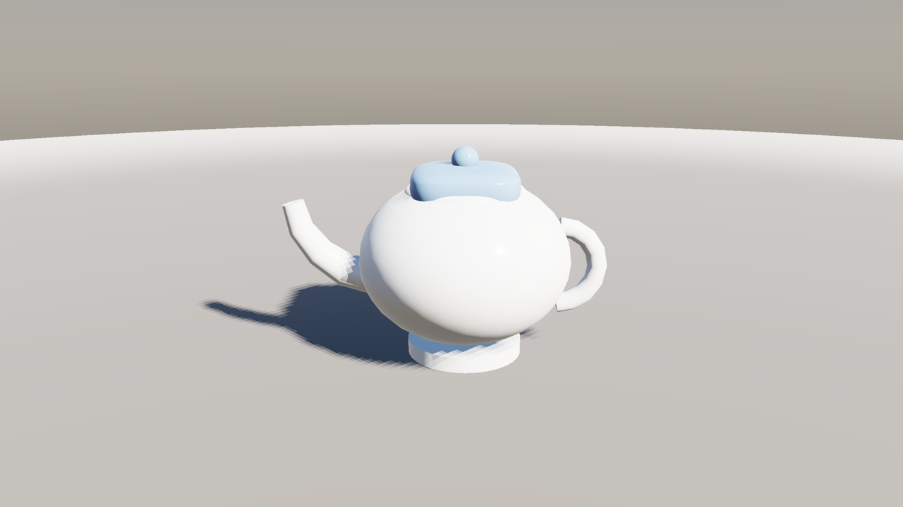 | 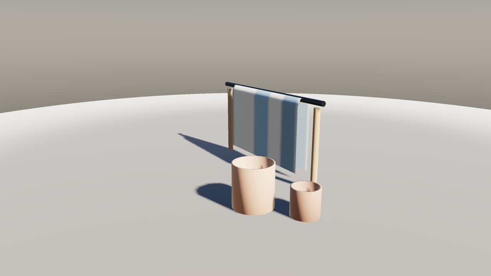 | 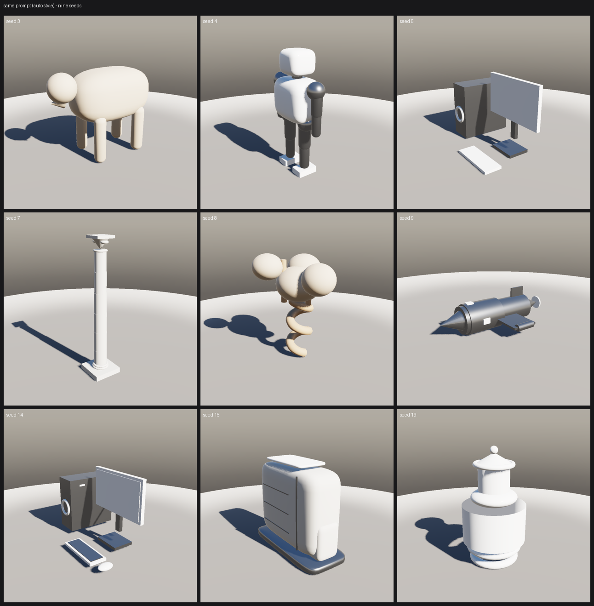 |  |
| **Teapot** — 8 parts: ellipsoid body, tapered spout, torus rim, superellipsoid lid | **Towel + vase** — soft-body cloth and frangible vessel (`iemodel/3` extras) | **Seed grid** — 9 seeds across 8 procedural style families, zero LLM calls | **Hero chair** — the seeded fallback that saved this banner (see below) |

## What the pipeline actually does

```text
Prompt -> SOUL rules -> LLM JSON spec -> one-round self-repair -> validator -> integrity repair
       -> point-cloud sampler -> mesh reconstruction -> preview/export
       (on provider failure: seeded deterministic style engine)
```

### 15 primitive kinds + two-level subtraction

The schema (`alignment/schema.py`) accepts **15 procedural primitives**: `box`, `sphere`, `cylinder`, `capsule`, `cone`, `torus`, `ellipsoid`, `prism`, `helix`, `plane`, `superellipsoid`, `tube`, `sweep`, `arch`, and `panel`. A primitive marked `role: "subtract"` cuts its target at two levels:

- **Mesh-level carve** — when the cutter describes a straight hole through a supported host (panel/box), the pipeline bores an actual tunnel. The arched chair above carries the log line `subtract: 'back_hole' carved a tunnel through 'back'`.
- **Point-cloud CSG-lite** — otherwise, points inside the cutter are removed at sampling time. That is what hollowed the mug.

The limits of both paths are documented honestly in [Honest limitations](#honest-limitations).

### Deterministic integrity repair — it will move your parts

Grounding, attachment, spacing, and framework repairs run after parsing, and they are not shy: the garden gate's render exists because `integrity (framework): snapped 9 vertical members between rails`; the arched chair's legs were `snapped to seat corners` and its back `attached to seat rear`. The validator enforces proportion guides too — the lounge chair's cushions were clamped from 0.15 m to 0.08 m because chairs don't have mattress-thick seats. Every one of these interventions is printed as a warning and preserved in the spec JSONs.

### 14 style families, fully seeded

When no LLM is configured — or the provider fails — the pipeline falls back to a seeded style engine with **14 families**: `abstract`, `architecture`, `creature`, `desktop_computer`, `furniture`, `futurist_chair`, `mechanical`, `modern_luxury`, `neoclassical_column`, `plant`, `robot`, `rococo_fence`, `spaceship`, and `vessel`. The seed grid above auditions 9 seeds across 8 of those families; same seed, same object, every time.

### Soft, frangible, and articulated authoring

`generation/soft_author.py` authors non-rigid assets with `iemodel/3` manifest extras:

- `author_cloth` — grid-mesh cloth with a `soft_body` block (the towel, `physics.body_type: "soft"`)
- `author_frangible_vessel` — closed lathe vessels with measured wall thickness and a brittleness-scaled `fracture` block (the vase, `body_type: "frangible"`)
- `author_rope` — swept tubes with `soft_body` rope dynamics
- `author_ragdoll` — capsule characters with an `articulation` block of 15 joints

The towel and vase manifests are checked in at [`docs/showcase/specs/towel.iemodel.json`](docs/showcase/specs/towel.iemodel.json) and [`docs/showcase/specs/vase.iemodel.json`](docs/showcase/specs/vase.iemodel.json).

### LLM pipeline with one-round self-repair — and a fallback that actually works

The **self-repair loop** (`llm/repair.py`, wired into `core/pipeline.py`) validates the streamed answer before it is accepted: unparseable JSON, an empty primitive list, or a spec so incoherent that integrity repair would have to rewrite more than 30% of its parts is sent back to the model exactly once, together with the validator's error list. If the second attempt still fails — or the provider never answers — the pipeline falls back to the seeded style engine, so the offline / no-key path behaves exactly as before.

This README's hero image is the proof. We tried to generate it with a cloud LLM (MiniMax-M3): the provider streamed 50–65 KB of `<think>` reasoning and never produced a parseable spec inside the stop budget — twice in a row. The pipeline's documented fallback engaged, and the banner you see is the seeded `futurist_chair` family at seed 42. The full story, including both failed attempts, is recorded in [`docs/showcase/specs/hero_chair.json`](docs/showcase/specs/hero_chair.json).

## Quick start

| Step | What to do | Command / action |
|---|---|---|
| 1 | Install from PyPI | `python -m pip install ironengine-3d-creator` |
| 2 | Launch the desktop app | `ironengine-3d-creator` |
| 3 | Start Ollama locally | `ollama serve` |
| 4 | Pull a compact local model | `ollama pull qwen3.5:0.8b` |
| 5 | Generate your first object | Set provider to `ollama`, select the model, enter a prompt, click **Generate** |

No LLM at hand? Click **Auto** — template generation and the seeded style engine work completely offline.

## Examples

Three runnable scripts under [`examples/`](examples/) reproduce showcase models end to end — spec construction, pipeline run with printed warnings, PLY/GLB/spec export, and an optional BonaFide render when that package is installed:

| Script | Demonstrates | Run |
|---|---|---|
| [`examples/showcase_garden_gate.py`](examples/showcase_garden_gate.py) | Multi-part architecture: `arch`, bars, scrollwork, framework repair (25 parts, 40 k points) | `python examples/showcase_garden_gate.py` |
| [`examples/showcase_teapot.py`](examples/showcase_teapot.py) | `role: "subtract"` CSG-lite, tapered `tube` spout, and the pipeline's own cutter warnings | `python examples/showcase_teapot.py` |
| [`examples/showcase_soft_authoring.py`](examples/showcase_soft_authoring.py) | Cloth + frangible vessels with `iemodel/3` `soft_body` / `fracture` extras | `python examples/showcase_soft_authoring.py` |

Outputs land in `examples/out/<name>/`. To re-render the full showcase gallery: `python tools/make_showcase.py`.

## Prompt-to-result

| Input | What the app does | Output |
|---|---|---|
| `A Chinese porcelain vase with cobalt blue painted bands and a polished ceramic finish` | The model emits a compact JSON spec, the integrity layer repairs structure, and the sampler reconstructs a dense point cloud for preview. | A vase you can inspect in points mode, switch to mesh mode, edit manually, and export to `PLY`, `PCD`, `GLB`, or `OBJ`. |

## Why it feels different

- **Local-first 3D generation**: pair the app with Ollama and lightweight `qwen3.5` models for a practical desktop workflow.
- **Structure before geometry**: the model emits a compact `GenerationSpec`, then deterministic integrity repair fixes common support and alignment mistakes.
- **Interactive editor, not a one-shot demo**: inspect the JSON spec, switch between point and mesh view, and make manual edits before export.
- **Package + app together**: install it like a Python package, run it as a desktop tool, and still script or extend the underlying pipeline.

## The desktop app

| Full UI | Point cloud viewport | Reconstructed mesh |
|---|---|---|
| 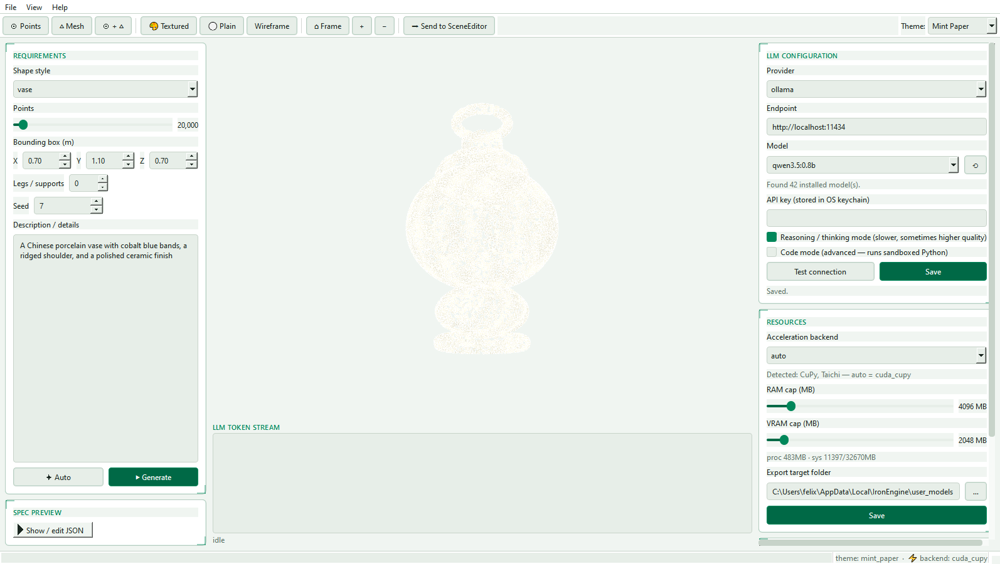 | 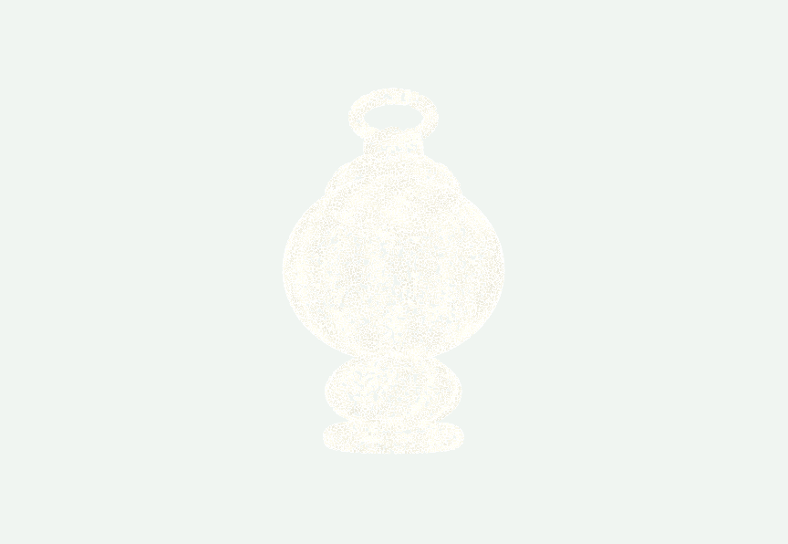 | 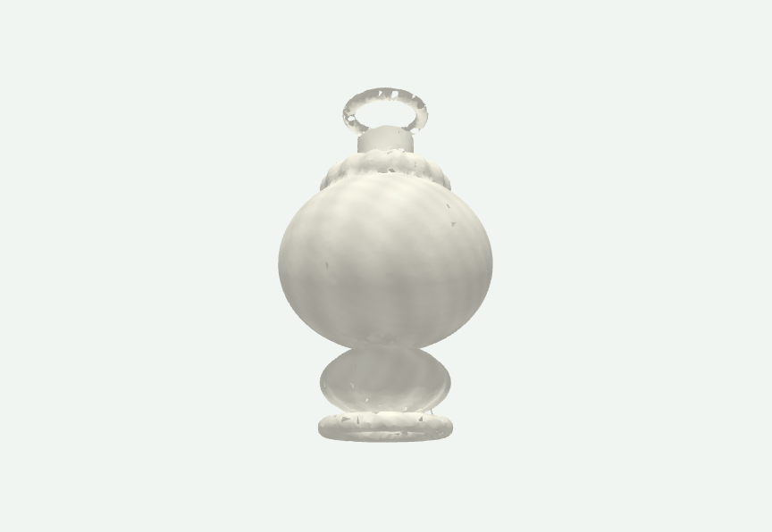 |

Captured from the local app flow in the `IronEngineWorld` Conda environment using Ollama with `qwen3.5:0.8b` and a porcelain-vase prompt.

## Highlights

- **Structured generation**: the LLM returns a compact `GenerationSpec` of primitives, transforms, labels, and surface features.
- **Deterministic integrity repair**: grounding, attachment, spacing, and framework repair happen after parsing so common structural failures are fixed automatically.
- **Panel-native style families**: the procedural style engine emits true `panel` primitives for desktops, tabletops, seats, and chair-back slats — 2-element in-plane `size` plus a separate `thickness`, rotated flat (rx=π/2) for horizontal tops and left upright for vertical slats. The validator keeps a compat shim that converts legacy box-semantics 3-element panel sizes, so old LLM output and saved specs keep working.
- **Non-rigid assets**: cloth, rope, frangible vessels, and ragdolls with `iemodel/3` physics extras.
- **Real desktop UI**: PySide6-based editor with prompt controls, streaming token view, live viewport, mesh mode, and editing tools.
- **Multiple model backends**: Ollama and LM Studio locally, plus Anthropic, OpenAI, MiniMax, and DeepSeek in the cloud.
- **Renderer API included**: offscreen render helpers let you create RGBA previews without opening the full app.
- **Package-ready layout**: Conda environment file, wheel manifest, packaged prompt rules, contributor guide, and changelog are included.

## At a glance

| Area | What it does |
|---|---|
| Generation | Produces 3D point clouds from text prompts or auto templates |
| Integrity | Repairs grounding, adjacency, symmetry, and framework alignment |
| Geometry | 15 primitive kinds: `box`, `sphere`, `cylinder`, `capsule`, `cone`, `torus`, `ellipsoid`, `prism`, `helix`, `plane`, `superellipsoid`, `tube`, `sweep`, `arch`, `panel`, plus two-level subtraction |
| Style engine | 14 seeded families for offline/fallback generation |
| Surface detail | Applies features such as `scratch`, `curve_pattern`, `bump_field`, `dent`, `erosion`, `ridges`, `holes`, and `fur` |
| Rendering | Shows points, mesh, or both with textured and plain color modes |
| Export | Writes `PLY`, `PCD`, `GLB` (PBR, per-part), and `OBJ`+`MTL`, plus an `iemodel/2` manifest with per-part materials and physics (mass, solid volume, colliders); `iemodel/3` extras add soft-body, fracture, and articulation blocks |
| Editing | Supports brush move, warp, paint, smooth, and undo/redo |
| Performance | Uses NumPy by default and can accelerate with optional GPU backends |

## Repository layout

```text
src/ironengine_3d_creator/
  alignment/   # parsing, schema, defaults, validation, integrity repair
  core/        # exporter, pipeline, resources, settings, session
  generation/  # samplers, features, textures, reconstruction, soft authoring
  llm/         # providers, prompts, model catalogs, thinking filters
  rendering/   # offscreen rendering API
  ui/          # Qt main window, panels, viewport, dialogs, workers

docs/
  INSTALL.md
  PROJECT_ANALYSIS.md
  assets/readme/  # UI screenshots
  showcase/       # BonaFide renders + the exact specs behind them

examples/      # runnable showcase scripts (see Examples)
tools/
  benchmark.py
  make_showcase.py  # regenerates docs/showcase/
```

## Installation

### Fastest path: install from PyPI

```powershell
python -m pip install ironengine-3d-creator
ironengine-3d-creator
```

### Recommended for contributors: Conda with `IronEngineWorld`

```powershell
conda env create -f environment.yml
conda activate IronEngineWorld
python -m pip install -e .
```

### If `IronEngineWorld` already exists

```powershell
conda activate IronEngineWorld
python -m pip install -e .
```

`open3d` is part of the base package requirements, so mesh reconstruction and export work out of the box after install.

<details>
<summary><strong>Need a fuller setup path?</strong></summary>

- Use `docs/INSTALL.md` for the more detailed installation and smoke-test flow.
- Prefer the editable install if you plan to modify the app or package metadata.
- Keep GPU extras optional unless they match your machine, CUDA stack, and drivers.

</details>

## Optional extras

Use extras only for features you actually want:

```powershell
python -m pip install -e .[anthropic]
python -m pip install -e .[openai]
python -m pip install -e .[gpu_taichi]
python -m pip install -e .[gpu_cupy]
python -m pip install -e .[gpu_torch]
python -m pip install -e .[nvidia]
python -m pip install -e .[sim]
python -m pip install -e .[all]
```

| Extra | Purpose |
|---|---|
| `gpu_taichi` | Cross-platform GPU fallback with Taichi |
| `gpu_cupy` | CUDA array acceleration through CuPy |
| `gpu_torch` | PyTorch-based GPU fallback |
| `nvidia` | VRAM/resource monitoring via NVML |
| `anthropic` | Anthropic provider support |
| `openai` | OpenAI provider support |
| `sim` | IronEngine Sim / viewer integration |
| `all` | Installs all optional extras in one step |

## Local Ollama setup

The default local path is Ollama. The project already works with available `qwen3.5` variants such as `qwen3.5:0.8b`, `qwen3.5:2b`, `qwen3.5:4b`, and `qwen3.5:9b` when those models are installed locally.

```powershell
ollama serve
ollama pull qwen3.5:0.8b
```

Then in the app:

1. Set **Provider** to `ollama`.
2. Keep **Endpoint** as `http://localhost:11434`.
3. Select a local `qwen3.5` model.
4. Save the config.
5. Enter your prompt and click **Generate**.

## Run the application

```powershell
conda activate IronEngineWorld
python -m ironengine_3d_creator
```

After installation, this also works:

```powershell
ironengine-3d-creator
```

## How to use the app

### 1. Configure the model

- Choose a provider in the right-side **LLM configuration** panel.
- For local usage, use `ollama` with a `qwen3.5` model.
- For cloud usage, use `anthropic`, `openai`, `minimax`, or `deepseek`. The panel is driven by the provider registry (`llm/registry.py`), so each provider's default endpoint, curated model list, and credential source are filled in automatically; the API-key field's placeholder shows exactly where the key resolves from.
  - **MiniMax** is OpenAI-compatible and defaults to the international endpoint `https://api.minimax.io/v1` (default model `MiniMax-M3`); keys issued for the China platform should change the endpoint to `https://api.minimaxi.com/v1`. Its key resolves from the `MINIMAX_API_KEY` environment variable, then the OS keychain, then legacy Credential Manager entries.
  - **DeepSeek** is OpenAI-compatible (endpoint `https://api.deepseek.com`, default model `deepseek-chat`). Its key resolves from the `DEEPSEEK_API_KEY` environment variable, then the OS keychain, then legacy Credential Manager entries predating this app.
- Turn on **Reasoning / thinking mode** when you want better deliberation and can afford slower generation.
- Leave **Code mode** off unless you specifically want sandboxed Python generation instead of structured JSON specs.

### 2. Describe the object

Use the left-side **Requirements** panel:

- Pick a shape hint or leave it on auto.
- Set the point budget.
- Tune the approximate bounding box.
- Add support counts when helpful.
- Write a plain-language prompt with material, silhouette, and detail cues.

Example prompts:

- `A Chinese porcelain vase with cobalt blue painted bands and a polished ceramic finish`
- `A weathered iron fence with evenly spaced bars and decorative finials`
- `A low wooden stool with four legs and deep scratches across the seat`
- `A stylized quadruped creature with a wide torso and short legs`

### 3. Generate and inspect

- Click **Generate** for LLM-driven output.
- Click **Auto** to use built-in template generation without an LLM.
- Watch the token stream while the provider emits reasoning or JSON.
- Inspect the spec preview after generation.

### 4. View the model

- Use **Points**, **Mesh**, or **Points + Mesh** in the toolbar.
- Toggle **Textured** or **Plain** color mode.
- Use **Wireframe** when evaluating reconstructed meshes.
- Press `F` to frame the cloud.

### 5. Edit and export

- Use brush, warp, paint, or smooth from the editing panel.
- Export to `PLY`, `PCD`, `GLB`, or `OBJ` (with a matching `MTL` material file). Spec-driven GLB export builds analytic per-primitive meshes with exact normals and UVs — full PBR with named per-part nodes, a baked `baseColorTexture`, `COLOR_0` vertex colors, and metallic/roughness factors. Spec-less clouds fall back to adaptive ball-pivot reconstruction with oriented normals (Poisson fallback) and keep vertex colors.
- Exporting `GLB` or `PLY` also writes a sibling `.iemodel.json` manifest (`iemodel/2`) describing the model for downstream tools:
  ```json
  {
    "schema": "iemodel/2",
    "name": "chair",
    "generator": "ironengine-3d-creator 0.2.0",
    "units": "meters",
    "up_axis": "Y",
    "aabb_min": [0, 0, 0], "aabb_max": [1, 1.2, 1], "bbox_size": [1, 1.2, 1],
    "material": {"name": "wood", "albedo": [0.55, 0.4, 0.32], "roughness": 0.65, "metallic": 0.0},
    "materials": {
      "wood": {"albedo": [0.55, 0.4, 0.32], "roughness": 0.65, "metallic": 0.0,
               "density_kg_m3": 700, "friction": 0.6, "restitution": 0.25}
    },
    "parts": [
      {"label": 0, "primitive": "box", "material": "wood",
       "aabb_min": [0, 0, 0], "aabb_max": [1, 0.5, 1], "solid_volume_m3": 0.5}
    ],
    "physics": {"density_kg_m3": 700, "friction": 0.6, "restitution": 0.25,
                "collider": "box", "dynamic": true,
                "solid_volume_m3": 1.1, "mass_kg": 770.0},
    "mesh": {"path": "chair.glb", "format": "glb", "vertices": 12345, "faces": 24680,
             "has_uvs": true, "has_vertex_colors": true, "analytic": true},
    "point_cloud": {"path": "chair.ply", "format": "ply", "points": 60000},
    "spec": {}
  }
  ```
  `physics.collider` is one of `box`, `convex`, or `parts` (chosen from the primitive kinds); `mass_kg` derives from the measured per-part solid volumes. Soft-authored assets extend this to `iemodel/3`, adding `physics.body_type` (`soft` / `frangible` / `articulated`) plus `soft_body`, `fracture`, or `articulation` blocks.
- Use **Send to SceneEditor** to hand off to downstream IronEngine tools when available. A background worker writes a timestamped `creator_model_*.{ply,glb,iemodel.json}` triple plus a `handoff.json` pointer into the export target dir, then launches SceneEditor with `--import <manifest>` so the object arrives with real scale, per-part PBR materials, and physics (mass, friction, restitution, collider) instead of untextured gray points.

## Keyboard shortcuts

| Action | Shortcut |
|---|---|
| Generate | `Ctrl+G` |
| Auto generate | `Ctrl+Shift+G` |
| Save session | `Ctrl+S` |
| Open session | `Ctrl+O` |
| Export | `Ctrl+E` |
| Undo | `Ctrl+Z` |
| Redo | `Ctrl+Y` or `Ctrl+Shift+Z` |
| User guide | `F1` |
| Frame camera | `F` |
| Points mode | `1` |
| Mesh mode | `2` |
| Points + mesh | `3` |

## Honest limitations

These are real behaviors observed while producing this README's renders — each is quoted from an actual pipeline warning preserved in [`docs/showcase/specs/`](docs/showcase/specs/):

- **Point-cloud subtraction only removes points that exist.** Cutters delete sampled points inside their volume. On the teapot — whose ellipsoid body is sampled as a pure surface — the hollow cutter `removed no points`, so the body stays visually solid (the mug's cap region, which had interior points, hollowed correctly). If you need a guaranteed cavity, use a straight hole through a `panel`/`box` host so the mesh-level carve applies.
- **Mesh-level carving is narrow by design.** It only handles straight tunnels through supported hosts; anything angled, curved, or through an unsupported shape falls back to point-cloud subtraction with the warning `cutter ... has no supported mesh-level host`.
- **Integrity repair will relocate your parts.** Finial-like labels (`finial`, `knob`, …) get stacked onto arch tops whether you meant it or not — the garden gate only kept its decorative balls after they were renamed away from finial vocabulary. Treat label vocabulary as meaningful, not decorative.
- **The validator enforces proportion guides.** The lounge chair's cushions were clamped from 0.15 m to 0.08 m because the chair guide says so. Authoring outside a guide is allowed, but expect the clamp warning.
- **Interpenetration is flagged, not always fixed.** Warnings like `part 'lid' is 72% inside 'body'` tell you parts overlap; the pipeline reports them and moves on.
- **Cloud LLMs can stall.** Long reasoning streams may never emit the JSON spec within the stop budget (see the MiniMax anecdote above) — the seeded fallback covers you, but its output is stylistic, not prompt-specific.
- **Mesh mode depends on reconstruction quality**, so very sparse generations may still look better in points mode.
- **GPU extras are optional** and should only be installed when they match your machine and drivers.

## Packaging and distribution

This repository is prepared to be consumed as a Python package.

### Build distributables

```powershell
conda activate IronEngineWorld
python -m build
```

### Install the built wheel locally

```powershell
conda activate IronEngineWorld
python -m pip install dist\ironengine_3d_creator-0.2.0-py3-none-any.whl
```

### Important packaging notes

- `SOUL.md` is bundled into the package so prompt rules still work from wheel installs.
- `environment.yml` provides the recommended Conda-first setup.
- `MANIFEST.in` includes the main docs and prompt assets in source distributions.
- The repository is licensed under the Apache License 2.0.

## Docs

- [`docs/INSTALL.md`](docs/INSTALL.md) — installation and package smoke-test notes
- [`docs/PROJECT_ANALYSIS.md`](docs/PROJECT_ANALYSIS.md) — architecture and repo-readiness audit summary
- [`docs/showcase/`](docs/showcase/) — rendered gallery plus the exact spec JSON behind every image
- [`CONTRIBUTING.md`](CONTRIBUTING.md) — development workflow notes
- [`CHANGELOG.md`](CHANGELOG.md) — tracked repository cleanup and packaging changes

## Known practical notes

- The best local experience comes from an already-running Ollama server.
- Small `qwen3.5` models are fast and usable because the app asks for a compact JSON recipe instead of full geometry.
- Mesh mode depends on point-cloud reconstruction quality, so very sparse generations may still look better in points mode.
- GPU extras are optional and should only be installed when they match your machine and drivers.

## License

This project is licensed under the Apache License 2.0. See [`LICENSE`](LICENSE) for the full text.

## Screenshot provenance

**UI screenshots** (`docs/assets/readme/`) were produced locally from the real application flow: Conda environment `IronEngineWorld`, provider `ollama`, model `qwen3.5:0.8b`.

**Showcase renders** (`docs/showcase/`) were generated by `tools/make_showcase.py` from checked-in `GenerationSpec`s and rendered with IronEngine BonaFide (CPU backend, procedural sky IBL, CSM shadows, 2× supersampling). The hero image is the seeded `futurist_chair` fallback (seed 42) after two documented MiniMax-M3 timeouts — see `docs/showcase/specs/hero_chair.json`.

If the UI or visual styling changes, refresh the embedded screenshots from a new local capture run before publishing.
